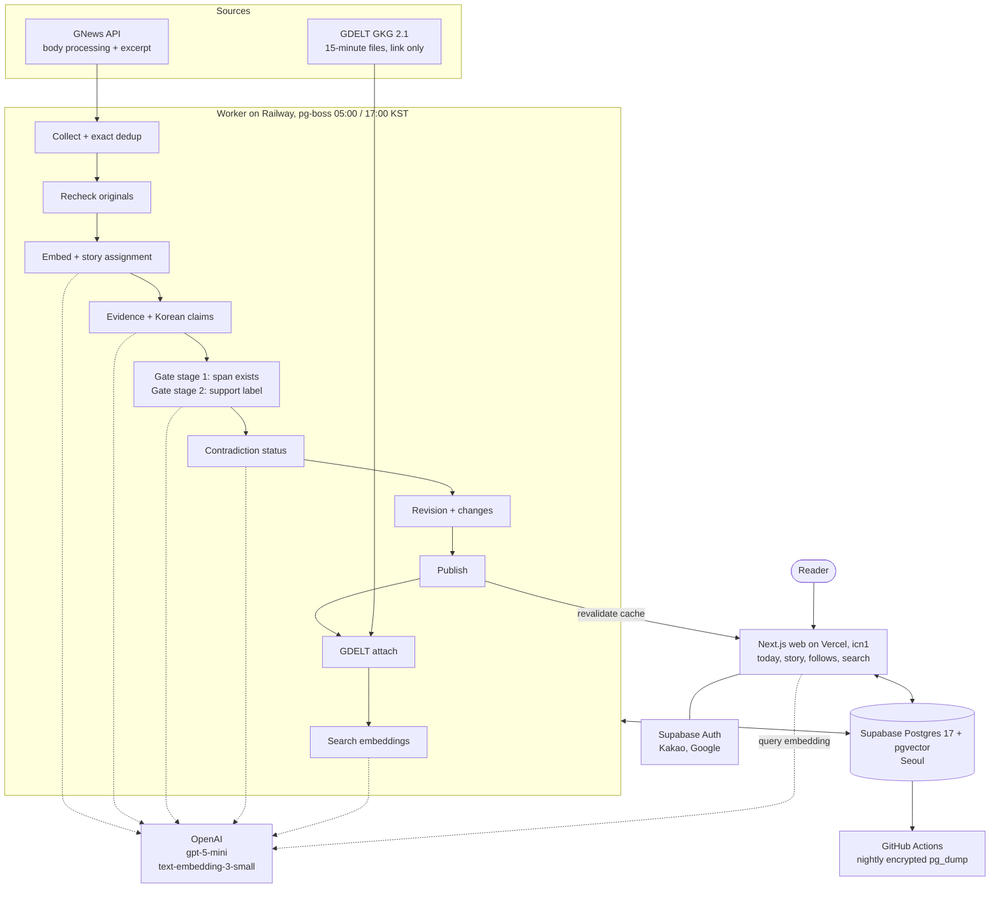

# ai-news-platform

[한국어](README.md)

A service that groups overseas English-language news into stories, presents each story as a list of Korean claims, links every claim to evidence spans in the English source text, and surfaces where sources disagree and what changed since you last read. It shows no political-bias scores and no confidence percentages.

The Korean README is the primary document; this is the second reading path with the same structure. Project documents (spec, ADRs, agent rules) are written in Korean.

- Live: <https://ai-news-platform-six.vercel.app> (every story, evidence span, revision history, and search works without logging in)
- Design and scope: [spec](docs/spec/v1.md) · glossary: [CONTEXT.md](CONTEXT.md) · decisions: [ADR index](docs/adr/)

## Core loop

1. **Today** — recent stories across four topics (overseas coverage of Korea; international politics, diplomacy and security; global economy and finance; technology and AI). The header always shows the last update time and the analysis-limit state.
2. **Story** — a list of Korean claims. Each claim shows its English evidence span (one or two sentences), source name and original link, and a contradiction-status badge (single source, multi-source agreement, reported conflict, conflict resolved, corrected).
3. **Conflicts and changes** — claims where sources disagree are shown side by side. The change section and revision strip show, per revision, claims added / removed / modified, contradiction-status changes, source-text changes, and added sources. Every revision has a fixed URL.
4. **Follow** — logged-in readers follow stories and topics; the follows page lists stories with changes since the last seen revision first.
5. **Search** — semantic search over story titles and claims with a Korean query.

## Five-minute reviewer path

1. On the live Today page, open the demo-story section. Demo stories are hand-written fictional articles from fictional sources based on real events, and carry a badge saying so.
2. `/story/demo-2-conflict` (simultaneous conflicting reports) — expand a claim to see its evidence span and original link, and see conflicting claims side by side.
3. `/story/demo-3-correction` (conflict resolved by an explicit correction) · `/story/demo-4-figures` (figure update) — see changes between revisions in the change section and the revision strip.
4. Open a live story from Today to see a source list that combines GNews evidence with GDELT link-only sources. Try a Korean query in Search.
5. Back in the repository, read the [evaluation report](docs/eval/report.md), the [ADR index](docs/adr/), and the [operations record](#operations-record) below.

Following and accounts can be tried with Kakao login. Google login works only for registered test users while the OAuth app is still in "testing" status ([operations environment](docs/agents/project.md#운영-환경)).

## Summaries by role

Both summaries point to the same evidence.

### Full-stack

- **One repository, one runtime**: a TypeScript pnpm workspace — [web](apps/web/) (Next.js 16 Cache Components, shadcn/ui + Tailwind v4), [worker](apps/worker/) (pg-boss batches at 05:00 and 17:00), [domain](packages/domain/src/) (pure TS, zero dependencies), [DB](packages/db/) (Drizzle), [pipeline](packages/pipeline/src/). The reasons are in the [ADR index](docs/adr/) (stack A, single OpenAI provider).
- **Data and security**: [migrations](packages/db/drizzle/), a [test](packages/db/src/public-rls.test.ts) that queries every `public` table for RLS, immediate cache expiry on rights-tier downgrades, cookie and IP counters plus a daily budget for anonymous search.
- **Accounts**: Supabase Auth (Kakao via direct OIDC, Google), follows and last seen revision, hard account deletion and deletion replay after a restore ([operations environment](docs/agents/project.md#운영-환경)).
- **Quality gates**: [CI](.github/workflows/ci.yml) (lint, types, tests, build, migrations on a disposable PG17 + pgvector), Playwright + axe [E2E](apps/web/e2e/) per page.
- **Operations**: Seoul hosting, encrypted nightly [backups](.github/workflows/backup.yml) and an isolated-DB [recovery drill](#operations-record), Railway settings as IaC ([.railway/railway.ts](.railway/railway.ts)).

### Applied AI

- **No claim is published without evidence**: evidence extraction → Korean claims → gate stage 1 (does the span actually exist in the source) → gate stage 2 (a support label per citation) → contradiction judgement. Code in the [pipeline](packages/pipeline/src/), rules in the [domain](packages/domain/src/) (one unit test per rule).
- **Evaluation**: [evaluation report](docs/eval/report.md), [golden-set index](packages/pipeline/fixtures/golden-set.json). How the golden set is built (two-model cross-check, operator adjudication of disagreements) is in the [ADR index](docs/adr/) and the [spec, "골든셋과 평가"](docs/spec/v1.md#골든셋과-평가).
- **Reproducibility**: replay tests that rerun a batch from recorded model responses without the network ([batch-run.test.ts](packages/pipeline/src/batch-run.test.ts), [demo-steps-replay.test.ts](packages/pipeline/src/demo-steps-replay.test.ts)). Each revision records its prompt version and model snapshot ID.
- **Cost ceiling enforced in code**: the maximum cost of a call is reserved before the call, and calls that would exceed the daily budget are not made ([budget.ts](apps/worker/src/budget.ts), [budget.test.ts](apps/worker/src/budget.test.ts)). Figures under [Cost](#cost).
- **Change tracking**: claim matching across revisions (deterministic rules, no embeddings or model), source-text rechecks and correction-marker detection.

## Architecture

Batch stages and order: [spec, "파이프라인"](docs/spec/v1.md#파이프라인). Hosting: [spec, "배포와 운영"](docs/spec/v1.md#배포와-운영) and the [ADR index](docs/adr/). Operational facts: [project.md](docs/agents/project.md#운영-환경).

## Data rights

- **GNews** (paid, body-processing + excerpt tier): screens show only the evidence span (one or two sentences), source name and original link; no screen ever shows a full article body. **GNews disclaims copyright in the articles it serves, so per-publisher copyright risk remains.** If the subscription ends, every GNews source is lowered to link-only and article bodies and evidence-span text are deleted.
- **GDELT** (GKG 2.1): link-only tier. Other outlets covering the same story are attached by title, source, URL and observation time; they are never used as evidence or as a reporting origin.
- **Rights tiers** are per source; when the operator lowers one, the screens change immediately.
- **Retention**: the policy is to delete article bodies 30 days after publication, keeping only evidence spans, hashes, URLs and metadata. The deletion job is being implemented in [#144](https://github.com/hz0705-blip/ai-news-platform/issues/144).
- **Demo stories** use fictional articles and fictional sources and live in a separate section.

Basis: [spec, "데이터 소스와 권리"](docs/spec/v1.md#데이터-소스와-권리), [ADR index](docs/adr/) (rights tiers and excerpt-only display).

## Cost

From the [spec, "개발 중 결정 항목"](docs/spec/v1.md#개발-중-결정-항목).

- Monthly ceiling $150. Planned breakdown: OpenAI about $42 + GNews €49.99 + Supabase Pro $25 + Railway about $10 ≈ $135.
- Daily model budget: pipeline $1.20, translation and search $0.20 combined. Before launch the pipeline budget is held at $0.06 through a worker environment variable and goes back to $1.20 at launch.
- Measured: about $0.019 per published story (63 stories, $1.177, first Railway batch). The second batch that day deferred everything because the remaining budget was smaller than one story's reservation ([#57 record](https://github.com/hz0705-blip/ai-news-platform/issues/57#issuecomment-5866723693)).

## Operations record

- **Recovery drill**: backup artifact → restore into an isolated DB → journal, row counts and web smoke check ([#57, first drill](https://github.com/hz0705-blip/ai-news-platform/issues/57#issuecomment-5866252546)). Targets are RPO ≤ 24 hours and RTO ≤ 60 minutes ([spec, "배포와 운영"](docs/spec/v1.md#배포와-운영)). Procedure in [project.md, "운영 환경"](docs/agents/project.md#운영-환경).
- **Deployments**: first web deploy [#30](https://github.com/hz0705-blip/ai-news-platform/pull/30), nightly backup [#33](https://github.com/hz0705-blip/ai-news-platform/pull/33), worker deploy and first real batch [#63](https://github.com/hz0705-blip/ai-news-platform/pull/63) · [#57 record](https://github.com/hz0705-blip/ai-news-platform/issues/57#issuecomment-5866621180). Rollback order in the [spec, "배포와 운영"](docs/spec/v1.md#배포와-운영).
- **Failures and regressions**:
  - The GDELT DOC API returned 429s and timeouts from both the dev and Railway IPs → replaced with streaming GKG 15-minute files ([#112](https://github.com/hz0705-blip/ai-news-platform/issues/112), [#114](https://github.com/hz0705-blip/ai-news-platform/pull/114)).
  - The `profile_image` scope that Supabase's Kakao provider requests by default made Kakao login fail with KOE205 → replaced with the app's own OIDC flow + `signInWithIdToken` ([#121](https://github.com/hz0705-blip/ai-news-platform/issues/121), [#122](https://github.com/hz0705-blip/ai-news-platform/pull/122)).
  - Starting the worker through the pnpm wrapper turned SIGTERM shutdowns into CRASHED deploys → wrapper removed from the start command ([#66](https://github.com/hz0705-blip/ai-news-platform/issues/66), [#72](https://github.com/hz0705-blip/ai-news-platform/pull/72)).
  - In the first recovery drill the dump's `CREATE SCHEMA public` line failed even on an empty DB → the dump keeps ACLs, restore uses `--no-owner --no-privileges`, and only that one restore error is allowed ([#32](https://github.com/hz0705-blip/ai-news-platform/issues/32), [#68](https://github.com/hz0705-blip/ai-news-platform/pull/68)).

## AI tool usage

Claude Code acts as the controller: it creates tickets from spec milestones, then for each ticket runs one implementation subagent and one review subagent to produce and merge a PR. Codex does research only.

- Rules: [CLAUDE.md](CLAUDE.md) (Claude), [AGENTS.md](AGENTS.md) (Codex), and ADR-0007 in the [ADR index](docs/adr/) for the process decision.
- History: [tickets](https://github.com/hz0705-blip/ai-news-platform/issues?q=is%3Aissue) · [research issues](https://github.com/hz0705-blip/ai-news-platform/issues?q=is%3Aissue+label%3Aresearch) · [merged PRs](https://github.com/hz0705-blip/ai-news-platform/pulls?q=is%3Apr+is%3Amerged). Each PR body's "무엇을 남겼나" section records implementation decisions (Rulings) and measured values.

## Running locally

Install, dev server, test and migration commands are in [project.md, "명령어"](docs/agents/project.md#명령어). Environment variable names are in [.env.example](.env.example).

## License

- Code: [MIT](LICENSE).
- Fixture articles and golden-set labels: CC-BY-4.0. Every fixture article is fictional text written for this repository. Scope and the one exception (GDELT open-data fields) are in [fixtures/LICENSE.md](packages/pipeline/fixtures/LICENSE.md).
