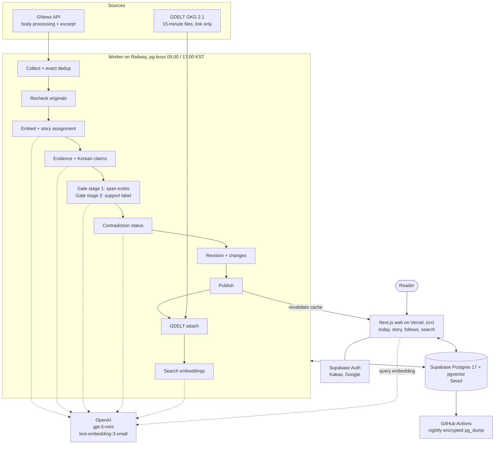

# ai-news-platform

[English](README.en.md)

해외 영어 뉴스를 사건 단위로 묶어 한국어 주장으로 보여주고, 모든 주장을 영어 원문 근거 구간에 연결하며, 출처들이 갈리는 지점과 마지막으로 읽은 이후의 변화를 드러내는 서비스다. 정치 편향 점수와 확신도 숫자는 두지 않는다.

- 배포: <https://ai-news-platform-six.vercel.app> (로그인 없이 모든 사건·근거·이력·검색을 쓸 수 있다)
- 설계와 범위: [스펙](docs/spec/v1.md) · 용어: [CONTEXT.md](CONTEXT.md) · 결정: [ADR 목록](docs/adr/)

## 핵심 루프

1. **오늘** — 토픽 4개(한국 관련 해외 보도, 국제 정치·외교·안보, 세계 경제·금융, 기술·AI)의 최근 사건 목록. 상단에 마지막 갱신 시각과 분석 한도 상태가 보인다.
2. **사건** — 한국어 주장 목록. 주장마다 영어 원문 근거 구간(1~2문장)과 출처명·원문 링크, 상충 상태 배지(단일 출처, 복수 출처 일치, 보도 상충, 상충 해소, 정정됨).
3. **상충·변화** — 출처가 다르게 말한 주장은 나란히 보이고, 변화 구획과 개정판 띠에서 개정판마다 주장 추가·삭제·수정, 상충 상태 변화, 원문 변경, 출처 추가를 본다. 개정판마다 고정 URL이 있다.
4. **팔로우** — 로그인 독자는 사건과 토픽을 팔로우하고, 팔로우 화면에서 마지막으로 본 개정판 이후 변화가 있는 사건부터 본다.
5. **검색** — 한국어 질의로 사건 제목과 주장을 의미 검색한다.

## 리뷰어용 5분 경로

1. 배포 URL의 오늘 화면에서 데모 사건 섹션을 연다. 데모 사건은 실제 사건을 바탕으로 직접 쓴 가상 기사·가상 출처이며 배지로 표시된다.
2. `/story/demo-2-conflict`(동시 보도 상충) — 주장을 펼쳐 근거 구간과 원문 링크를 확인하고, 상충하는 주장이 나란히 보이는 것을 본다.
3. `/story/demo-3-correction`(명시 정정으로 상충 해소) · `/story/demo-4-figures`(수치 변화) — 변화 구획과 개정판 띠에서 개정판 사이 변화를 본다.
4. 오늘 화면의 라이브 사건 하나를 열어 GNews 근거와 GDELT 링크만 출처가 함께 붙은 출처 목록을 본다. 검색에서 한국어로 질의해 본다.
5. 저장소로 돌아와 [평가 리포트](docs/eval/report.md), [ADR 목록](docs/adr/), 아래 [운영 기록](#운영-기록)을 읽는다.

팔로우·계정은 Kakao 로그인으로 확인할 수 있다. Google 로그인은 OAuth 앱이 아직 "테스트 중"이라 등록된 테스트 사용자만 된다([운영 환경](docs/agents/project.md#운영-환경)).

## 직무별 요약

두 요약은 같은 증거를 가리킨다.

### 풀스택

- **한 저장소, 한 런타임**: TypeScript pnpm 워크스페이스 — [웹](apps/web/)(Next.js 16 Cache Components, shadcn/ui + Tailwind v4), [워커](apps/worker/)(pg-boss 05·17시 배치), [도메인](packages/domain/src/)(순수 TS, 의존성 0), [DB](packages/db/)(Drizzle), [파이프라인](packages/pipeline/src/). 선택 이유는 [ADR 목록](docs/adr/)(스택 A·OpenAI 단일 제공자).
- **데이터와 보안**: [마이그레이션](packages/db/drizzle/), `public` 테이블 RLS를 모두 켰는지 질의하는 [테스트](packages/db/src/public-rls.test.ts), 사건 캐시·권리 등급 하향 시 즉시 만료, 익명 검색의 쿠키·IP 카운터와 일일 예산.
- **계정**: Supabase Auth(Kakao 직접 OIDC·Google), 팔로우와 마지막으로 본 개정판, 계정 하드 삭제와 복원 뒤 삭제 기록 재적용([운영 환경](docs/agents/project.md#운영-환경)).
- **품질 게이트**: [CI](.github/workflows/ci.yml)(린트·타입·테스트·빌드, 일회용 PG17 + pgvector 마이그레이션), 페이지마다 Playwright + axe [E2E](apps/web/e2e/).
- **운영**: 서울 호스팅, 암호화한 야간 [백업](.github/workflows/backup.yml)과 격리 DB [복구 훈련](#운영-기록), Railway 설정의 IaC([.railway/railway.ts](.railway/railway.ts)).

### 적용 AI

- **근거 없는 주장은 발행하지 않는다**: 근거 추출 → 한국어 주장 → 게이트 1단계(근거 구간이 원문에 실제로 있는가) → 게이트 2단계(인용마다 뒷받침 판정) → 상충 판정. 코드는 [파이프라인](packages/pipeline/src/), 규칙은 [도메인](packages/domain/src/)(규칙마다 단위 테스트).
- **평가**: [평가 리포트](docs/eval/report.md), [골든셋 목록](packages/pipeline/fixtures/golden-set.json). 골든셋 구성 방법(두 모델 교차 검증, 불일치 운영자 판정)은 [ADR 목록](docs/adr/)과 [스펙 "골든셋과 평가"](docs/spec/v1.md#골든셋과-평가).
- **재현성**: 기록된 모델 응답으로 네트워크 없이 배치를 다시 돌리는 리플레이 테스트([batch-run.test.ts](packages/pipeline/src/batch-run.test.ts), [demo-steps-replay.test.ts](packages/pipeline/src/demo-steps-replay.test.ts)). 개정판은 프롬프트 버전과 모델 스냅샷 ID를 기록한다.
- **비용 상한을 코드로 강제**: 호출 전 최대 비용을 예약하고 일일 예산을 넘는 호출은 하지 않는다([budget.ts](apps/worker/src/budget.ts), [budget.test.ts](apps/worker/src/budget.test.ts)). 수치는 아래 [비용](#비용).
- **변화 추적**: 개정판 사이 주장 매칭(결정론 규칙, 임베딩·모델 없음), 원문 재수집과 정정 표지 판별.

## 아키텍처

배치 단계와 순서는 [스펙 "파이프라인"](docs/spec/v1.md#파이프라인), 호스팅은 [스펙 "배포와 운영"](docs/spec/v1.md#배포와-운영)과 [ADR 목록](docs/adr/), 운영 사실은 [project.md](docs/agents/project.md#운영-환경).

## 데이터 권리

- **GNews**(유료, 본문 처리 + 발췌 표시 등급): 화면에는 근거 구간(1~2문장)과 출처명·원문 링크만 나오고 기사 본문 전체는 어떤 화면에도 나오지 않는다. **GNews는 기사 저작권을 부인하므로 발행사별 저작권 위험이 남는다.** 해지하면 GNews 출처를 모두 링크만 등급으로 내리고 본문과 근거 구간 원문을 지운다.
- **GDELT**(GKG 2.1): 링크만 등급. 같은 사건을 다룬 다른 출처를 제목·출처·URL·관측 시각으로 붙이고, 근거나 보도 원점으로 쓰지 않는다.
- **권리 등급**은 출처 단위이며 운영자가 낮추면 즉시 화면에 반영된다.
- **보존**: 정책은 기사 본문을 발행 30일 뒤 삭제하고 근거 구간·해시·URL·메타데이터만 남기는 것이다. 삭제 작업은 [#144](https://github.com/hz0705-blip/ai-news-platform/issues/144)에서 구현 중이다.
- **데모 사건**은 가상 기사·가상 출처이며 별도 섹션에만 둔다.

근거: [스펙 "데이터 소스와 권리"](docs/spec/v1.md#데이터-소스와-권리), [ADR 목록](docs/adr/)(권리 등급과 발췌만 표시).

## 비용

[스펙 "개발 중 결정 항목"](docs/spec/v1.md#개발-중-결정-항목) 기준.

- 월 상한 $150. 계획 구성은 OpenAI 약 $42 + GNews €49.99 + Supabase Pro $25 + Railway 약 $10 ≈ $135.
- 일일 모델 예산은 파이프라인 $1.20, 번역·검색 합계 $0.20. 출시 전에는 파이프라인 예산을 워커 환경변수로 $0.06에 두고 출시 때 $1.20으로 되돌린다.
- 실측: 발행한 사건당 약 $0.019(63사건 $1.177, 첫 Railway 배치). 같은 날 둘째 배치는 남은 예산이 사건 하나의 예약보다 작아 전부 미뤘다([#57 기록](https://github.com/hz0705-blip/ai-news-platform/issues/57#issuecomment-5866723693)).

## 운영 기록

- **복구 훈련**: 백업 아티팩트 → 격리 DB 복원 → 저널·행 수·웹 스모크 검증([#57 복구 훈련 1회](https://github.com/hz0705-blip/ai-news-platform/issues/57#issuecomment-5866252546)). 목표는 RPO ≤ 24시간, RTO ≤ 60분([스펙 "배포와 운영"](docs/spec/v1.md#배포와-운영)). 절차는 [project.md "운영 환경"](docs/agents/project.md#운영-환경).
- **배포**: 웹 첫 배포 [#30](https://github.com/hz0705-blip/ai-news-platform/pull/30), 야간 백업 [#33](https://github.com/hz0705-blip/ai-news-platform/pull/33), 워커 배포와 첫 실제 배치 [#63](https://github.com/hz0705-blip/ai-news-platform/pull/63)·[#57 기록](https://github.com/hz0705-blip/ai-news-platform/issues/57#issuecomment-5866621180). 롤백 순서는 [스펙 "배포와 운영"](docs/spec/v1.md#배포와-운영).
- **실패와 회귀**:
  - GDELT DOC API가 개발·Railway IP 모두 429·시간 초과 → GKG 15분 파일 스트리밍으로 교체([#112](https://github.com/hz0705-blip/ai-news-platform/issues/112), [#114](https://github.com/hz0705-blip/ai-news-platform/pull/114)).
  - Supabase Kakao 제공자의 기본 scope에 든 `profile_image`로 Kakao 로그인이 KOE205 오류 → 앱 직접 OIDC + `signInWithIdToken`으로 교체([#121](https://github.com/hz0705-blip/ai-news-platform/issues/121), [#122](https://github.com/hz0705-blip/ai-news-platform/pull/122)).
  - 워커를 pnpm 래퍼로 시작하면 SIGTERM 종료가 CRASHED로 기록 → 시작 명령에서 래퍼 제거([#66](https://github.com/hz0705-blip/ai-news-platform/issues/66), [#72](https://github.com/hz0705-blip/ai-news-platform/pull/72)).
  - 첫 복구 훈련에서 덤프의 `CREATE SCHEMA public` 한 줄이 빈 DB 복원에서도 실패 → 덤프는 ACL을 보존하고 복원에서 `--no-owner --no-privileges`, 복원 오류는 그 1건만 허용([#32](https://github.com/hz0705-blip/ai-news-platform/issues/32), [#68](https://github.com/hz0705-blip/ai-news-platform/pull/68)).

## AI 도구 사용 내역

이 저장소는 Claude Code가 컨트롤러로 스펙 마일스톤에서 티켓을 만들고, 티켓마다 구현 서브에이전트·리뷰 서브에이전트로 PR을 만들어 머지한다. Codex는 리서치만 맡는다.

- 규칙: [CLAUDE.md](CLAUDE.md)(Claude), [AGENTS.md](AGENTS.md)(Codex), 절차 결정은 [ADR 목록](docs/adr/)의 ADR-0007.
- 이력: [티켓](https://github.com/hz0705-blip/ai-news-platform/issues?q=is%3Aissue) · [리서치 이슈](https://github.com/hz0705-blip/ai-news-platform/issues?q=is%3Aissue+label%3Aresearch) · [머지된 PR](https://github.com/hz0705-blip/ai-news-platform/pulls?q=is%3Apr+is%3Amerged). PR 본문 "무엇을 남겼나"에 구현 중 결정(Ruling)과 실측값이 있다.

## 로컬 실행

설치·개발 서버·테스트·마이그레이션 명령은 [project.md "명령어"](docs/agents/project.md#명령어)에 있다. 환경변수 이름은 [.env.example](.env.example).

## 라이선스

- 코드: [MIT](LICENSE).
- 픽스처 기사와 골든셋 라벨: CC-BY-4.0. 픽스처의 기사는 모두 직접 쓴 가상 텍스트다. 범위와 예외(GDELT 공개 데이터 부분)는 [fixtures/LICENSE.md](packages/pipeline/fixtures/LICENSE.md).
