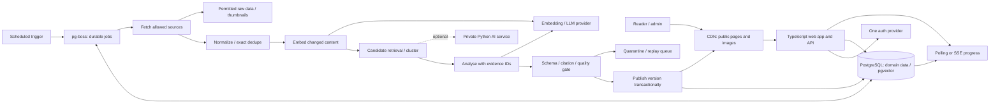

# Issue #3 — Stack, architecture, infrastructure and cost

## 요약

- 권고안은 TypeScript 중심 모듈형 모놀리스와 별도 작업 프로세스다. Python 서비스는 실제 모델·학습 요구가 생길 때 추가한다.
- 비교안은 Next.js 중심, React Router + FastAPI 중심, SvelteKit 중심의 세 가지다.[1][3][4][6]
- 뉴스·출처·분석 이력과 벡터를 PostgreSQL에 함께 저장하고, 검색 성능을 측정한 뒤 전용 벡터 DB를 검토한다.[10][11]
- 수집 파이프라인은 단계별 재시도·중복 방지·버전 기록을 갖추고 검증된 분석만 발행하도록 설계한다.[19][20]
- 한국어 검색은 영어 설정을 그대로 재사용하지 않고 별도 평가한다. Meilisearch와 Typesense도 후보가 된다.[27][28]
- 한국 서비스의 Kakao 로그인과 글로벌 서비스의 Google·GitHub 로그인을 구분해 검증한다.[24][25]
- 프레임워크 이름보다 출처 추적, 검색·군집 평가, 장애 복구, 비용 통제의 실증이 포트폴리오 핵심이라는 판단이다.
- 예시 월 예산은 A $90–180, B $100–190, C $75–165이며 뉴스 이용료·세금·GPU 비용은 별도다.[45][50][53][54][57]
- 아래 버전·기능은 2026-09-15에 확인한 자료 기준이며, 설치 호환성·실측 성능·실제 청구액은 별도 검증 대상이다.

## Scope

**Research snapshot: 2026-09-15 (Asia/Seoul).** All present-tense vendor capabilities, version observations and prices in this document are dated to this snapshot unless an explicit release date is given. Sources are first-party documentation, release records and specifications. A mutable `latest` page is evidence of what was retrieved, not a promise about future releases. Undated pages have an access date, not an invented publication date. Proposed choices, thresholds and workload assumptions are **author recommendations or estimates**, not measured product facts.

The brief concerns a solo developer's general-news analysis product ingesting 1–5k articles/day, targeting both full-stack and AI/ML interviews. Korean and global launch choices remain separate. This research does not select a market, approve publisher rights, provision infrastructure or establish repository architecture authority. No dependency installation, compatibility build, load test or provider checkout was performed. Prices exclude taxes and exchange conversion unless stated otherwise.

## Findings

### 1. Versions and front-end choices

The following are **concrete candidate baselines**, not a generated or tested lockfile. Pin dependencies after a compatibility build and apply security patches before deployment. Patch precision is used where a release page establishes it; managed database extensions must be checked in the selected project.[1][6][9][10][11]

| Component | Evidence at snapshot | Interpretation for this project |
|---|---|---|
| Next.js / React | Next.js **16.3.3** appears in the 2026-08-25 security release; React's version page lists **19.3.0**, released 2026-09-09, and **19.2.7**.[1][2] | Candidate: Next.js 16.3.3 with React 19.3.0, subject to peer-dependency and SSR integration checks. Next.js is attractive for public article pages and a React portfolio; this is a design judgment, not hiring-market evidence. |
| React Router / Remix | React Router changelog lists **8.3.1**; the official Remix announcement directs Remix v2 users toward React Router framework mode.[3][4] | Candidate: React Router 8.3.1 + React 19.3.0. Treat older “Remix v2 versus React Router” comparisons as historical; framework mode supplies the full-stack route boundary. |
| SvelteKit / Svelte | Official latest-release targets resolve to **SvelteKit 2.70.3** and **Svelte 5.57.0**; the release stream also contains SvelteKit 3 prereleases.[5][6] | Candidate: stable 2.70.3 + 5.57.0. Choose for developer preference and demonstrable UI quality; no sourced claim here that its job market or performance is superior. |
| TanStack Start | Official overview still identifies **v1 release candidate** status and describes SSR, streaming, server functions and typed routing.[7] | An explicit experimental alternative, not one of the three default production candidates. Lock an exact published build and test hosting adapters if selected; do not claim stable v1 from its name. |
| Node / TypeScript | Node **24** is an LTS line. TypeScript **6.0** is documented; the latest official release resolves to **7.0.2**.[8][9] | Candidate baseline: Node 24 LTS + TypeScript 6.0.x for established tooling compatibility, with patch resolution in the lockfile. This deliberately does not call TS6 “latest”; validate TS7 across framework, lint and codegen tools before adopting it. |
| Python / FastAPI | Python **3.13.15** and **3.14.7** were released 2026-08-05; FastAPI **0.141.1** is dated 2026-07-29.[12][13] | Candidate AI runtime: Python 3.13.15 + FastAPI 0.141.1. Resolve and lock model-library versions after model selection; this research has not verified their Python wheels. |
| PostgreSQL / pgvector / ORM | PostgreSQL lists **18.6** and **17.11** as supported; pgvector README uses **0.8.6**; Drizzle's latest stable-release target is **0.45.2**.[10][11][14] | Prefer the host's supported PostgreSQL 17/18 release and installed pgvector 0.8.x. Drizzle 0.45.2 is the conservative ORM baseline; do not assume every managed host already exposes pgvector 0.8.6. |

**Front-end trade-off (author assessment based on the documented programming models):**

| Choice | Practical distinction for the news UI |
|---|---|
| Next.js / React | Server Components can read data on the server while Client Components handle interaction. This fits public reading pages with interactive filters/bookmarks; the trade-off is learning serialization, server/client boundaries and cache invalidation. A plain React SPA remains reasonable for an admin-only screen; for the public product, this report prefers server-rendered content as a design choice. [78] |
| React Router framework mode | Route loaders/actions, generated route types and SPA/SSR/static rendering modes provide a route-centered approach. This is a useful choice when the Python boundary should remain explicit and the developer wants React without adopting Next.js's component model. It also works without Python; the pair in B is optional composition. [77] |
| SvelteKit | Page/layout load functions distinguish server-only and universal data loading. Choose it when this route model and Svelte improve personal delivery speed; SSR data isolation and invalidation still need deliberate design. [76] |
| TanStack Start | Typed routes/search parameters, server functions and streaming favor a strongly typed app interface. The observed RC status adds adoption uncertainty; select it for a specific routing benefit, with deployment validation, rather than as a required portfolio ingredient. [7] |

### 2. TypeScript alone versus a Python boundary

FastAPI exposes OpenAPI and JSON Schema interfaces. Sentence Transformers is a Python ecosystem for embedding and reranking models. These support a meaningful Python boundary when local inference, fine-tuning, evaluation tooling or custom clustering actually uses Python libraries.[15][16]

**Recommendation:** keep fetching, API-provider calls, validation, persistence, user sessions and publication in TypeScript initially. Calling an external LLM is not itself a reason for another HTTP service. Add Python when a named model/library or experiment requires it; a Python offline evaluation package can precede a deployed service. The benefit should be demonstrated by a quality/cost experiment, not by a language count.[15][16]

For a split, use a private FastAPI endpoint with a versioned OpenAPI contract and generated TypeScript client. Send small bounded batches and stable article/version IDs; return validated structured results. One TypeScript component owns scheduling and domain writes, while Python owns model computation. Avoid two independent ORMs competing to migrate the same tables. FastAPI's `BackgroundTasks` runs after responses, and its documentation points heavy computation toward larger task tools; it is not the durable ingestion scheduler recommended here.[15][17]

### 3. Database, vector retrieval and ORM

| Choice | Verified capability | Recommendation / trade-off |
|---|---|---|
| PostgreSQL + pgvector | pgvector provides exact and approximate vector search, including HNSW and IVFFlat, inside PostgreSQL. Approximate filtering can reduce returned matches; iterative scans can recover additional candidates.[11] | Default: keep article metadata, source provenance, memberships, analysis versions and embeddings transactionally close. Start with filtered exact search where practical; add HNSW after measuring recall and latency. Queue activity and vector indexing compete for the same database resources. |
| Qdrant | Purpose-built vector engine with payload filtering and cloud/self-hosted deployment paths.[18] | Consider when retrieval needs independent scaling or measured filtered-search behavior is inadequate in PostgreSQL. Retain PostgreSQL as authority and build a repairable projection into Qdrant. |
| Pinecone | Managed vector database documentation covers serverless indexes, dense/sparse search and metadata filtering.[21] | Useful when managed retrieval operations justify another bill and dependency. Assess provider regions, deletion guarantees and minimum charges before adopting. |
| Turbopuffer | Its architecture places durable data in object storage with SSD/RAM caching; it offers vector and full-text search.[22] | A candidate for a larger retained corpus. Benchmark cold and warm query behavior and filters; no measured advantage at this workload is established here. |
| Drizzle | Official guide exposes pgvector columns, distance operations and HNSW indexes.[23] | Preferred for this SQL-heavy domain: inspect query plans and keep reviewed SQL migrations. ORM types do not replace runtime validation. |
| Prisma | Versioned v7 database documentation remains available. Prisma's PostgreSQL extension guide describes custom SQL and `Unsupported` vector fields; newer unversioned extension documentation describes a pgvector extension API.[29][30] | Viable for teams favoring its generated client, but match documentation to the pinned major. Vector support is version-dependent: do not repeat the blanket claim “Prisma cannot use pgvector.” Validate migration and typed vector query workflow before choosing it. |

**Proposed migration trigger:** benchmark on the retained corpus with language/date/topic filters, measure exact-search recall against approximate results, and record p95 latency during ingestion. Move to a dedicated engine only after failing an agreed target despite query/index tuning. No article-count-only crossover or unsupported “millions require a vector DB” rule is claimed.[11][18][21][22]

### 4. Jobs and scheduling

| Tool | Evidence at snapshot | Fit for periodic ingestion and LLM processing |
|---|---|---|
| pg-boss | Node/PostgreSQL queue using `SKIP LOCKED`, scheduling, retries, dead-letter handling and transactional job creation. Current source package identifies the 12.x line.[19] | **Default with an always-on Node worker.** It reuses PostgreSQL and supports enqueue plus domain write in one transaction. Isolate queue schema, prune completed jobs and measure database contention. |
| BullMQ | Supports scheduling, retries and workers. Redis is the default; current docs also describe an optional PostgreSQL backend, so “requires Redis” is no longer universally accurate.[20][31] | Strong alternative when its flow/concurrency APIs are useful or Redis already exists. Evaluate backend maturity and deployment requirements of the pinned version. |
| Inngest | Durable steps, retries, event/cron triggers and flow control; execution can run on the application's own compute.[32] | Best managed alternative for an HTTP/serverless app. Persist small step results and price orchestration operations separately from compute. |
| Trigger.dev | Long-running tasks, scheduled tasks, retries, queues/concurrency and replay are documented.[33] | Good when managed task execution removes worker operations. Check duration, machine and run charges; task execution is a separate deployment concern. |
| Temporal | Workflow history enables replay; workflow logic must be deterministic, with external effects performed in activities.[34] | Technically strong for long-lived workflows, approvals and multiple workers. Defer for this solo demo unless workflow durability itself is the intended portfolio specialization. |
| Plain cron | A timer alone does not supply the job durability provided by the queue/workflow systems above.[19][32][34] | Use only as a trigger into durable jobs, or for a tiny replayable pilot with stored watermarks, mutual exclusion and bounded retries. It is insufficient as the sole state store. |

**Correctness recommendation:** treat remote side effects as potentially repeated even if a queue advertises exactly-once delivery. A crash after a billable LLM response but before durable acknowledgement can leave an uncertain result. Use idempotency keys where the provider supports them, unique database constraints, persisted stage outputs, bounded retries/backoff and a failed-job replay view. BullMQ explicitly recommends idempotent, small jobs; pg-boss's delivery guarantee should not be enlarged into an end-to-end guarantee over external APIs.[19][20]

### 5. Cache, authentication, images and search

| Area | Evidence | Project choice |
|---|---|---|
| Cache | HTTP cache control and validators are standardized; private and shared caches have different reuse rules.[35] | Cache public published article/cluster pages at the CDN with short freshness plus revalidation. Include language and analysis revision in keys. Keep account/session/admin responses private. Add Redis only after measuring a need; store reusable model results durably by content/model/prompt version. |
| Supabase Auth | Supports Google, GitHub, Kakao and custom OAuth/OIDC providers.[24][25] | Default when Supabase is the database provider: one identity authority. Enforce ownership in application queries/RLS, with service credentials kept server-side. |
| Better Auth | Self-hosted installation and Kakao integration are documented; latest release resolves to **1.7.5**.[26] | Alternative when controlling auth tables/runtime matters, particularly with Neon or another PostgreSQL host. The developer owns operational configuration and upgrades. |
| Auth.js | Its maintainers announced that Auth.js joined Better Auth; a migration guide exists.[36] | Maintain existing deployments when appropriate; for a new build compare Better Auth directly rather than selecting Auth.js from an old tutorial. This is not a claim that all Auth.js versions are abandoned. |
| Clerk | Offers hosted authentication APIs/prebuilt UI and social connections; limits and paid features are plan-specific.[37] | Fastest UI-oriented candidate by author judgment, but validate required providers and monthly retained-user billing. Do not equate the pricing metric with generic MAU. |
| Images | Next.js image handling supports remote-source restrictions and resizing/optimization.[38] | Display only images whose use is authorized. Restrict remote hosts, enforce byte/type/dimension limits, precompute a small set of thumbnail sizes and store permitted derivatives in object storage. Avoid per-request transformations of arbitrary publisher URLs; provide a neutral fallback. This is an engineering proposal, not a rights determination. |
| PostgreSQL FTS | PostgreSQL offers configurable text-search dictionaries and stemming.[39] | Start with language-specific FTS plus exact entity/date/source filters and pgvector reranking. Preserve source language; do not apply an English stemmer to every article. |
| Meilisearch | Its language documentation lists Korean dictionary segmentation through Lindera and multilingual search capabilities.[27] | Prefer a measured pilot if Korean tokenization, autocomplete or typo tolerance materially improves the reader experience. The search index remains a rebuildable projection. |
| Typesense | Locale-aware processing uses ICU, supports `ko`, and allows custom pre-segmented queries.[28] | Another measured candidate for multilingual keyword UX. Language support does not establish correct ranking for Korean names, spacing variants or news terminology. |

### 6. Architecture and pipeline

**Recommended design, not an implemented system:** a modular monolith in one repository with independently started web and worker processes, one PostgreSQL authority, and explicit modules for sources, ingestion, retrieval, analysis, publishing and accounts. Scaling the worker independently does not require splitting every domain into services. A Python service is the optional boundary justified in §2.[15][19]

Pipeline stages should persist resumable state; the following is the proposed application protocol supported by transactional jobs and idempotent-stage guidance.[19][20]

1. **Fetch:** use per-source watermarks, deadlines and rate limits. Store source ID, original URL, publication timestamp, observation timestamp, language and rights/retention metadata. Separate event time from ingestion time.
2. **Dedupe:** normalize URLs conservatively and hash normalized content. A unique source item/content-version key suppresses retries. Similarity-based near-duplicate detection should preserve provenance rather than delete distinct publishers' evidence.
3. **Embed:** key stored vectors by content hash, model/version, dimensions and preprocessing revision. Reuse unchanged results; schedule re-embedding explicitly when the model changes.
4. **Cluster:** restrict candidate retrieval by time and relevant metadata; record membership/version and assignment score. Support split/merge correction. Evaluate cross-language clustering separately from same-language clustering.
5. **Analyse:** supply bounded evidence with stable citation IDs; persist model, prompt, parameters, token usage, cost and raw validated output. Analyse changed clusters rather than blindly regenerate every article.
6. **Publish:** validate schema, citation existence and source/version alignment. Failed checks go to quarantine. Atomically create an immutable analysis revision and update the public pointer; invalidate derived page/search caches only after commit.

These details are recommendations rather than claims of already proven accuracy. A reproducible replay fixture should demonstrate recovery after failures between every two stages.[19][20]

### 7. API and real-time choices

| Interface | Evidence and trade-off | Recommendation |
|---|---|---|
| REST + OpenAPI | FastAPI generates OpenAPI/JSON Schema contracts.[15] | Default for Python boundaries, public API and job status. Prefer explicit resource IDs, cursor pagination and versioned error shapes; return `202` plus a job ID for queued work. |
| tRPC | Provides end-to-end TypeScript API type inference without code generation.[40] | Optional internal TS app API. It does not replace a language-neutral contract with Python or authorization checks. |
| GraphQL | Clients select fields from a typed schema.[41] | Defer until multiple clients genuinely need flexible graph traversal; resolver authorization and query-cost control become additional work. |
| Server actions / framework actions | Next.js documents server actions as public-facing endpoints requiring input validation and authorization.[42] | Use thin UI mutations that call domain functions. Keep ingestion and public API contracts independent of component internals. |
| Polling | Can reuse HTTP resource and cache semantics.[35] | Default: bounded status polling while a page is active, with backoff and visibility pause. Proposed initial interval: 15–30 seconds; tune from usage. |
| SSE | HTML EventSource specifies server-to-client event streams, reconnection and event IDs.[43] | Add for ingestion progress or publication notices if latency matters. Persist event cursors and support resync; a live connection is not the durable state store. |
| WebSocket | RFC6455 specifies bidirectional communication.[44] | Defer until collaboration or interactive duplex traffic exists; periodic news publication normally needs only server-to-client notifications. |

### 8. Korean versus global launch

| Decision | Korean-first scenario | Global scenario |
|---|---|---|
| Search | Evaluate Korean spacing, particles, compound nouns, Hangul/Latin names and transliteration. Compare PostgreSQL baseline with Meilisearch Korean segmentation and Typesense `ko` using human relevance labels.[27][28][39] | Evaluate per-language keyword ranking and cross-language retrieval separately. Store locale with content and avoid translating away original evidence.[27][39] |
| Authentication | Test Kakao consent and missing-email cases; Supabase/Better Auth document that email scope can require business verification.[24][26] | Google/GitHub are documented provider options; choose the smallest set needed by intended readers.[25][37] |
| AI evidence | Proposed evaluation must include Korean sources and Korean output, plus distinct Korean/English source-to-output cases; framework or tokenizer support alone is insufficient evidence of model quality.[16][27] | Proposed evaluation must be stratified by source/output language rather than reporting one global average.[16][27] |
| Data placement | Choose application/worker/database region together after checking available Asian regions and real latency; Korean hosting eligibility is not inferred from a vendor's global marketing. | Keep the write database in one region initially and cache public reads geographically; choose write location from actual audience and source constraints. These are architecture proposals. |
| Localization | Keep stored timestamps in UTC and display Asia/Seoul explicitly; preserve canonical publisher URLs. | Use explicit reader locale/timezone and localized public URLs; preserve canonical publisher URLs. These are product proposals. |

### 9. Hosting, regions, and monthly cost

**Price observation date: 2026-09-15.** USD/month, before taxes; one developer and one production environment. These are public list-price observations, not checkout quotes or performance measurements. Render's dynamic table and Neon's pricing were recovered from their official indexed pages; their exact checkout amounts need reconfirmation. Vercel's live table supersedes older conflicting allowance snippets. Numbers below distinguish vendor facts from explicit workload assumptions. [45][47][54]

| Provider | Free allowance and operational cliff | Paid entry and relevance to this app |
|---|---|---|
| Vercel | Hobby is personal/non-commercial; 100GB transfer, 1M edge requests, 4 CPU-hours and 360 GB-hours of function memory/month. Commercial use or quota exhaustion moves the demo off this baseline. [45] | Pro $20/month with $20 usage credit for one developer; metered resources can exceed it. Fluid compute starts at $0.128/CPU-hour and $0.0106/GB-hour; Seoul rates are $0.169 and $0.0140. Good for A's web app; budget the ingestion worker separately. [45][46] |
| Render | 750 shared free web instance-hours/month; idle web services sleep after 15 minutes. Free Postgres expires after 30 days, then has a 14-day upgrade grace period. A free web instance is unsuitable for a continuously reliable ingestion worker. [48] | Hobby workspace $0 plus compute; app/worker $7 each at 512MB, $25 each at 2GB. Postgres starts at $6/256MB or $19/1GB, plus storage; Pro workspace adds $25. $7 → $25 per process is the useful RAM cliff. [47] |
| Fly.io | New-account trial lasts 2 VM-hours or 7 days, whichever comes first; it is not ongoing free hosting. [52] | Default public selector shows $1.94/month for shared-1x/256MB, but extraction does not identify that region: **do not use this as a Korea quote**. Volumes $0.15/GB-month; APAC internet egress $0.04/GB. Managed Postgres starts at $38 plus $0.28/GB storage. VM RAM, extra replicas and managed DB are separate cost steps. [51] |
| Railway | $5 trial credits for 30 days, then Free supplies $1/month of resources with 0.5GB RAM/service and 0.5GB volume limits. Paid persistent workloads generally outgrow this. [49] | Hobby minimum $5, Pro minimum $20, each credited toward usage: do not add the fee twice. RAM $10/GB-month, CPU $20/vCPU-month, egress $0.05/GB, volumes $0.15/GB-month. Good for persistent Node/Python workers. [49][50] |
| Supabase | 500MB DB, 1GB objects, 5GB egress plus 5GB cached egress, 50k MAU; pauses after one inactive week. DB capacity, rather than auth MAU, is the likely first limit here. [53] | Pro from $25, first project included: 8GB disk, 100k MAU, 250GB egress. Extra projects start at $10; disk overage $0.125/GB. Compute upgrades and PITR (from $100/month) can dominate this small base. [53] |
| Neon | Per project: 100 CU-hours/month, 0.5GB storage; compute scales to zero after inactivity. Regular queue polling can remove the practical idle savings. [54] | Launch $0.106/CU-hour + $0.35/GB-month; Scale $0.222/CU-hour. “Typical $15” is an example, not a flat plan. At 0.25 CU continuously for 720 hours, compute alone is $19.08 (calculated). [54] |
| Cloudflare | Workers Free: 100k dynamic requests/day, 10ms CPU/invocation. Static asset requests are free. The CPU ceiling can bite before request count during parsing/SSR. [55] | Workers Paid $5 minimum includes 10M requests + 30M CPU-ms; then $0.30/M requests and $0.02/M CPU-ms. R2 Standard includes 10GB, 1M write-class and 10M read-class operations; then $0.015/GB-month, $4.50/M and $0.36/M respectively, with free egress. Use R2/CDN across stacks; moving a Node/Python worker to Workers needs a runtime compatibility check. [55][56] |

**Region choice (recommendation based on availability):** For Korean readers, A can put Vercel functions and Supabase in Seoul; a Railway ingestion worker is available in Singapore, so batch its cross-region DB operations. B/C can colocate the app, worker and database in Singapore to avoid repeated inter-region SQL round trips, then measure Korean reader latency before choosing that over Seoul. Railway and Render list Singapore; Supabase lists Seoul, Tokyo and Singapore. For global readers, select one primary region near the initial audience and cache public pages worldwide; multi-region writes are not an initial requirement. A CDN does not eliminate origin database latency. No cross-border legal compliance is inferred from region selection. [46][58][59][60]

#### Workload model: articles/day is not a hosting benchmark

The following are **planning assumptions and calculations as of 2026-09-15**, not measured throughput or model-quality claims. Assume 30 days; 30k–150k retained articles/month; 30-day hot retention; one embedding/article; 2,000 embedding tokens/article; one event analysis per ten articles, with 6,000 input and 800 output tokens/analysis; 15% budget overhead for retries/re-analysis. No separate LLM extraction/classification call per article is included. Public reader traffic is assumed modest (100k dynamic requests and 10GB app egress/month, 20GB for split B); images are cached objects. [50][55][57]

- **Data capacity estimate:** at 20KB source text + 10KB relational/analysis metadata/article, text/rows occupy 0.9–4.5GB/month. A hypothetical 1,536-dimensional float32 vector adds about 0.184–0.922GB before headers/indexes. HNSW, FTS indexes, WAL, queues and backups are extra; size the selected embedding dimensions explicitly. A 90-day archive multiplies retained data by three. Thus 0.5GB DB free tiers are not a dependable live-demo foundation; even 8GB requires retention and index-size measurement at 5k/day. These byte sizes are assumptions, not article-corpus statistics. [53][54]
- **AI price example:** the current Google table lists Gemini 2.5 Flash-Lite at $0.10/M text input and $0.40/M output tokens, and Gemini Embedding 2 text at $0.20/M. Used only for reproducible budgeting; no claim that these models meet Korean or English quality targets. [57]
- **Calculation:** embedding costs $12–60; cluster analyses cost $2.76–13.80; applying 1.15 overhead gives **$16.97–84.87/month**. Formula: `1.15 × [(articles × 2000 / 1M × .20) + (articles / 10 × (6000 × .10 + 800 × .40) / 1M)]`. If instead every article receives a 2,000-input/600-output-token analysis, the same formula becomes **$28.98–144.90/month** including embeddings/overhead. Extra classification, translation, reranking, judges and user chat increase these figures. [57]
- Korean and English need separate measured token distributions and evaluation sets: the 2,000-token assumption must not be silently treated as equivalent text length in both languages. Translating every retained article adds another per-article generation stage; selectively translating published event analyses is a proposed cost control. [57]

| Stack deployment example | Infrastructure subtotal under stated assumptions | Subtotal including cluster-level AI example | Practical budget envelope (recommendation) |
|---|---|---|---|
| A: Vercel Pro web + Railway worker + Supabase Pro | $20 + worker (1GB average RAM, 0.1 average vCPU, 10GB egress = $12.50) + $25 = **$57.50**. [45][50][53] | **$74.47–142.37**. [57] | **$90–180/month** before news licenses/taxes; leaves modest headroom, not a hard ceiling. |
| B: Railway React Router app + Node worker + Python AI service + Supabase Pro | Across all three processes: combined 3GB average RAM, 0.3 average vCPU, 20GB egress = $37; DB $25; **$62**. Python task execution shares this allocation, with no GPU. [50][53] | **$78.97–146.87**. [57] | **$100–190/month** for API-backed AI. Local neural models/GPU require a fresh capacity/cost measurement. |
| C: Railway SvelteKit app/worker + Neon Launch + Better Auth | Combined 1.5GB average RAM, 0.2 average vCPU, 10GB egress = $19.50; DB 0.25 CU × 720h × .106 + 5GB × .35 = $20.83; **$40.33**. [50][54] | **$57.30–125.20**. [57] | **$75–165/month**, plus any required transactional-email service. |

These subtotals assume the selected compute can keep up: **not load-tested**. At 5k/day, cluster-level jobs average only about 21/hour, but ingestion bursts, vector-index builds, article length and local model memory determine capacity. Budget envelopes are author allowances, not provider quotes. R2 stays free in the example only if permitted images/snapshots and operations fit its allowances; large images or long retention change that. Excluded costs: paid news feeds/licensing (unknown), domain, email, VAT/FX, GPU, extra preview databases, premium auth features and paid tracing. [50][53][54][56]

**Cost controls:** persist model/prompt/content hashes to avoid repeat work; cap per-source fetches, per-day tokens and paid job attempts; backpressure on provider 429s; retain a last-good published view when spending stops. Set billing alerts and hard limits deliberately—Railway's compute hard limit takes workloads offline. Keep production traces sampled: Langfuse Free has 50k units/month; Core starts at $29 with 100k units, then $8/100k at the initial usage tier. Units include more than just a single logical article, so full tracing is a separate cost cliff. [68][72]

### 10. Engineering quality: proposed release evidence

The practices below are **recommendations dated 2026-09-15**, adapted to this ingestion application; they are not claims that this repository already implements them. GitHub Actions provides free standard hosted runners for public repositories; GitHub Free private repositories include 2,000 minutes/month and 500MB artifact storage. Do not assume larger runners or unlimited artifact retention are free. [61]

| Layer | Proposed checks and evidence |
|---|---|
| CI/CD | On each PR: frozen dependency install, formatting/lint, type checks, unit tests, real Postgres integration tests, production build and a small Playwright suite. Deploy immutable build artifacts after required checks; use isolated previews, migration rehearsal, backward-compatible schema expansion and a documented rollback/restore exercise. Pin third-party Actions by full commit SHA; keep token permissions minimal; never give untrusted PR code production secrets. Use short-lived OIDC credentials where the chosen host supports them, otherwise scoped deployment tokens. [62][63] |
| Unit and contract | Test canonical URLs, source IDs, language routing, time parsing, content hashes, idempotency keys, stage-transition rules and model-output schema validation. Use deterministic provider fixtures in normal CI. For B, generate/check the TS client from the Python OpenAPI contract and test authentication, timeouts and error-schema drift across that boundary. This is application-specific test design, not a claim of SDK coverage. [62][69] |
| Integration | Use the actual Postgres/pgvector extension version and queue implementation: concurrent duplicate arrivals, unique constraints, transactional job enqueue, worker death before/after DB commit, retry exhaustion, provider 429/timeout, stalled jobs, failed citations and reprocessing with a new model version. Verify one published revision per idempotency key, plus migration and backup restoration. Fault handling is part of the product contract. [69] |
| E2E | Playwright: browse published events, inspect source citations, filter/search in Korean and English, log in/bookmark, recover from delayed processing, mobile keyboard navigation and access-control denial. Assert user-visible behavior with stable role/label locators and isolated test accounts; capture CI traces on retry. Avoid brittle exact generated-text snapshots. [63] |
| LLM quality | Version a held-out, source-grounded dataset; compare each new model/prompt against the same cases. Proposed initial set: 100 events, balanced Korean/English and including politics/economy/tech, duplicates, conflicting reports, corrections and malicious source text. Record atomic-claim support, citation correctness, cluster precision/recall, abstention, freshness, cost and latency by language. Use deterministic schema/reference checks plus human labels; calibrate model judges against those labels, and repeat stochastic samples. Dataset size is a starting proposal, not statistical proof. Langfuse supports datasets and reproducible comparisons; store dataset/model/prompt versions with results. [66][71] |

**Release gate proposal:** require all deterministic schema, permissions and citation-ID checks to pass; reject cases where article-borne instructions cause tool execution or publication without validation. Compare factuality/cluster metrics per language against the accepted baseline and report sample counts/uncertainty; choose the acceptable factual-error rate with the owner before launch. Time-split news evaluation to prevent future reports leaking into an earlier “known at” analysis. Freeze model outputs in frontend E2E; run the paid live-model regression separately with a token cap. These are proposed checks grounded in evaluation and LLM risk guidance, not measured success rates. [66][71]

#### Observability

OpenTelemetry provides traces, metrics and logs as instrumentation signals; it does not itself supply a complete hosted storage/alerting backend. Propagate trace/job/article/event IDs from scheduled fetch through publication, and emit structured JSON logs with stage, attempt, latency, outcome and model version. Proposed dashboard: oldest-job age, ingest-to-publish p95, fetch failures by source, duplicate ratio, tokens and cost per published event, citation failures, DB connections and vector-query p95. Alert on sustained freshness loss, retry exhaustion and daily spend. Keep source URLs/IDs in durable records instead of high-cardinality metric labels. [64]

Use Sentry for web/backend exceptions and release correlation (Developer is $0 for one user), and Langfuse for sampled model traces, prompt versions and evaluation results. Start with hosted offerings; self-hosting observability adds services to operate. Redact secrets, user identifiers and restricted article text **before** telemetry export; Langfuse documents application/export masking. Record safe hashes and source identifiers when full text cannot be retained. [65][66][67]

#### Security mapped to the current OWASP baseline

OWASP's web baseline is **Top 10:2025**, supplemented by its 2025 LLM risks. The following controls are this report's concrete application mapping. [69][71]

| Risks | Controls for this news app |
|---|---|
| A01 access control; A07 authentication | Authorize every bookmark/admin/reprocess operation on the server; deny by default; test ownership/RLS with separate users. Secure, HttpOnly cookies, appropriate SameSite and CSRF protection; admin MFA and session revocation. Auth UI does not prove authorization. [73][75] |
| A02 configuration; A04 cryptography | TLS, restrictive CORS/CSP, private DB/worker endpoints, separate runtime roles and migrations role. Store API/DB keys in host secret stores; never public frontend environment variables or logs. Separate dev/prod credentials and rotate after exposure. [74][62] |
| A03 supply chain; A08 integrity | Lockfiles, reviewed dependency updates, pinned Actions, protected release artifacts, authenticated job/webhook endpoints and durable source/model provenance. [69][62] |
| A05 injection; ingestion SSRF | Parameterized SQL; sanitize article HTML and generated Markdown; allowlist URL schemes/approved feed hosts; reject private/loopback/link-local addresses, revalidate DNS and each redirect, and cap redirects, bytes and time. Test fetch and image-proxy paths against SSRF. [73][70] |
| A06 insecure design; LLM prompt injection/excessive agency | Treat article text as untrusted evidence; give analysis no shell, arbitrary network or write tools; validate structured output and citation membership before publication. Do not place secrets in prompts. An instruction saying “ignore malicious text” alone is insufficient isolation. [69][71] |
| A09 logging; A10 exceptional conditions; LLM unbounded consumption | Audit admin changes, failed logins and publishing decisions; scrub personal data. Rate-limit login/search/reanalysis separately by account/IP, enforce source/provider concurrency, payload/token quotas and bounded retries; handle quota exhaustion without retry storms or partial publication. [73][71] |

For Korean and global deployments, keep deletion/retention and telemetry destinations explicit, with the owner deciding permitted source text, user data and vendor processing. A specific database region is a technical placement control, not evidence that privacy or publisher obligations are satisfied. Legal determination and news licenses remain outside this stack research. [58]

## Options & trade-offs

### Three concrete stack sets

Shared candidate baseline: Node 24 LTS, TypeScript 6.0.x, PostgreSQL 17.11 or 18.6 depending on host, installed pgvector 0.8.x, Drizzle 0.45.2, pg-boss 12.x, object storage for permitted thumbnails, HTTP caching, PostgreSQL FTS, and Supabase Auth when using Supabase. Resolve exact dependency patches and managed extension versions during implementation; these combinations were not installed in this research.[8][9][10][11][14][19][23][25][35][39]

| Set | Concrete components | Why choose it | Main cost / complexity trade-off |
|---|---|---|---|
| **A — React, one application language** | Next.js 16.3.3 + React 19.3.0; shared baseline; Next.js route handlers/actions; Node worker calling hosted AI; Supabase Auth.[1][2][19][25][42] | Recommended starting point: public content, interactive reader UI and ingestion share TypeScript domain modules. Full-stack plus applied-AI evidence can come from evaluation and retrieval without a live Python service. | Web and worker remain separate runtime processes. Framework caching and server/client boundaries must be understood. Provider-model dependency persists. |
| **B — React plus explicit Python AI service** | React Router 8.3.1 + React 19.3.0 in framework mode; Python 3.13.15 + FastAPI 0.141.1; shared baseline; private OpenAPI AI endpoint; Node worker orchestrates; Supabase Auth.[2][3][4][12][13][15][19] | Choose when local embedding/reranking, custom clustering or model training is a core deliverable. Python can own the ML algorithm while the TS app owns product operations.[16] | Three runnable components: web, Node worker and Python AI service. Additional deploy, contract and timeout/failure coordination. Python model memory/GPU cost requires measurement. |
| **C — SvelteKit, one application language** | SvelteKit 2.70.3 + Svelte 5.57.0; shared baseline; SvelteKit route/form actions; Node worker; Better Auth 1.7.5 if using independent PostgreSQL, or Supabase Auth with Supabase.[5][6][19][25][26] | Choose when Svelte expertise improves delivery speed and UI quality. Same ingestion/data design as A; language choice does not force different ML logic. | Less direct React demonstration. Auth self-hosting adds maintenance if Better Auth is chosen. Hiring relevance is an owner decision; this report does not claim market-share evidence. |

TanStack Start remains an opt-in variation for typed routing/server functions under the source's RC status. It is not necessary to add a fourth stack to demonstrate framework awareness.[7]

### Interview talking points by stack

These are proposed demonstrations, not claims that the project currently implements them. Bring a benchmark, trace, replay or failing-then-passing test for each selected point; the cited capabilities provide the mechanism, not proof of the result.[11][19][20][32][43]

| Stack | Full-stack interview talking points | AI/ML interview talking points |
|---|---|---|
| A | Explain server/client boundaries, public cache invalidation after publish, session authorization, SQL indexes, transactional enqueue and recovery from worker crashes.[19][35][42] | Compare retrieval baselines, report citation/unsupported-claim rates, show prompt/model versioning and cost per accepted analysis. Explain why hosted inference was sufficient and where a Python boundary would improve the system.[11][16][20] |
| B | Demonstrate OpenAPI-generated client compatibility, private-service authentication, request deadlines, idempotent orchestration and independent model deployment.[15][19][20] | Show reproducible embedding/reranker experiments, language-stratified results, cluster error analysis and a measured CPU/GPU/batch-size trade-off. Explain why Python was required by a concrete library/model workflow.[16] |
| C | Demonstrate progressive form UX, SSR state handling, accessible reading layouts, authentication lifecycle, SQL migrations and cache correctness.[5][26][35] | Show that framework choice is independent of retrieval/analysis quality: identical evaluation corpus and pipeline invariants, Korean search experiments and replayable prompt/model changes.[11][20][27][28] |

## Recommendation

**Start with set A, PostgreSQL + pgvector, and pg-boss on a separately deployed Node worker.** Keep domain modules reusable from web and worker. Use one managed authentication authority and make public reading possible without an account where product requirements permit. This is the author's balance of solo delivery and product-grade evidence, not a benchmark-derived universal best stack.[1][11][19][25]

**Promote to set B only for a named ML capability.** If the portfolio must demonstrate model training, local reranking or a Python-specific clustering experiment, make that explicit and budget its service. Otherwise keep Python evaluation offline initially. A maintained experiment with baselines and reproducible results is a stronger artifact than a second service that merely forwards LLM requests; this is an assessment criterion proposed by the author.[15][16]

Keep search as a PostgreSQL implementation behind a narrow retrieval interface. For a Korean-first launch, run a labeled query pilot early and choose Meilisearch or Typesense if it demonstrates materially better results. Keep source facts, derived analyses and translations versioned separately. Choose infrastructure using the quantified scenarios above, then validate source rights, reliability and operating budget with the owner.[11][27][28][39]

**Implementation evidence to request:** one ingestion replay demonstrating idempotency, one labeled Korean/global retrieval comparison, one analysis-quality report with cost, one restore exercise, and one deploy/rollback demonstration. These are proposed acceptance artifacts, not completed implementation tests.[19][20]

## Open questions for the interview

1. Which launch comes first: Korean readers, English/global readers, or bilingual readers? Must queries retrieve across languages?
2. Which interview signal matters most: full-stack product delivery, applied AI evaluation, or model training/local inference? Which concrete Python-only capability earns a service?
3. What monthly hard cap covers infrastructure, models, licensed news, transactional email and observability? Can ingestion stop at that cap?
4. Is the demo noncommercial, or will it include ads, paid access, business use or a commercial launch? What uptime/freshness promise should the budget support?
5. What licensed content, images and retention period are available? Must users inspect original evidence, stored text, translations or only publisher links?
6. What is acceptable publication delay, and which failures should block publication versus show a pending state?
7. Are anonymous reading and Google/GitHub enough initially, or is Kakao required? Are bookmarks/accounts necessary for the first demonstration?
8. Who will label Korean and other-language relevance, clustering and citation quality? What failure rate would prevent launch?
9. What initial audience region and privacy constraints govern where accounts, source content and model traces may be processed?

## Sources

All sources accessed **2026-09-15**. Release dates are stated in the body only when verified. Documentation paths can change; version-specific claims should be rechecked before installation.

1. Next.js August 2026 security release — https://nextjs.org/blog/august-2026-security-release — accessed 2026-09-15.
2. React official versions — https://react.dev/versions — accessed 2026-09-15.
3. React Router changelog — https://reactrouter.com/changelog — accessed 2026-09-15.
4. Remix: React Router v7 transition — https://remix.run/blog/react-router-v7 — accessed 2026-09-15.
5. SvelteKit v2 migration and architecture documentation — https://svelte.dev/docs/kit/migrating-to-sveltekit-2 — accessed 2026-09-15.
6. SvelteKit/Svelte official releases — https://github.com/sveltejs/kit/releases/tag/@sveltejs/kit@2.70.3 ; https://github.com/sveltejs/svelte/releases/tag/svelte@5.57.0 ; https://github.com/sveltejs/kit/releases — accessed 2026-09-15.
7. TanStack Start overview — https://tanstack.com/start/latest/docs/framework/react/overview — accessed 2026-09-15.
8. Node.js release policy/status — https://nodejs.org/en/about/previous-releases — accessed 2026-09-15.
9. TypeScript 6.0 notes and observed 7.0.2 release — https://www.typescriptlang.org/docs/handbook/release-notes/typescript-6-0.html ; https://github.com/microsoft/TypeScript/releases/tag/v7.0.2 — accessed 2026-09-15.
10. PostgreSQL support/version policy — https://www.postgresql.org/support/versioning/ — accessed 2026-09-15.
11. pgvector official implementation/documentation — https://github.com/pgvector/pgvector — accessed 2026-09-15.
12. Python core release announcement, 2026-08-05 — https://blog.python.org/2026/08/python-3147-31315/ — accessed 2026-09-15.
13. FastAPI release notes — https://fastapi.tiangolo.com/release-notes/ — accessed 2026-09-15.
14. Drizzle stable release 0.45.2 — https://github.com/drizzle-team/drizzle-orm/releases/tag/0.45.2 — accessed 2026-09-15.
15. FastAPI features/OpenAPI — https://fastapi.tiangolo.com/features/ — accessed 2026-09-15.
16. Sentence Transformers documentation — https://www.sbert.net/ — accessed 2026-09-15.
17. FastAPI background tasks — https://fastapi.tiangolo.com/tutorial/background-tasks/ — accessed 2026-09-15.
18. Qdrant overview — https://qdrant.tech/documentation/overview/ — accessed 2026-09-15.
19. pg-boss documentation and source version — https://github.com/timgit/pg-boss ; https://github.com/timgit/pg-boss/blob/master/package.json — accessed 2026-09-15.
20. BullMQ scheduling and idempotence — https://docs.bullmq.io/guide/job-schedulers/ ; https://docs.bullmq.io/patterns/idempotent-jobs — accessed 2026-09-15.
21. Pinecone documentation overview — https://docs.pinecone.io/guides/get-started/overview — accessed 2026-09-15.
22. Turbopuffer architecture — https://turbopuffer.com/docs/architecture — accessed 2026-09-15.
23. Drizzle pgvector guide — https://orm.drizzle.team/docs/guides/vector-similarity-search — accessed 2026-09-15.
24. Supabase Kakao guide — https://supabase.com/docs/guides/auth/social-login/auth-kakao — accessed 2026-09-15.
25. Supabase social authentication — https://supabase.com/docs/guides/auth/social-login — accessed 2026-09-15.
26. Better Auth installation, Kakao and release — https://better-auth.com/docs/installation ; https://better-auth.com/docs/authentication/kakao ; https://github.com/better-auth/better-auth/releases/tag/v1.7.5 — accessed 2026-09-15.
27. Meilisearch language/tokenization documentation — https://www.meilisearch.com/docs/resources/help/language — accessed 2026-09-15.
28. Typesense locale documentation — https://typesense.org/docs/guide/locale.html — accessed 2026-09-15.
29. Prisma v7 supported databases — https://www.prisma.io/docs/orm/v7/core-concepts/supported-databases — accessed 2026-09-15.
30. Prisma extension documentation (version-sensitive; native search excerpts accessible, direct retrieval failed) — https://docs.prisma.io/docs/postgres/database/postgres-extensions ; https://www.prisma.io/docs/orm/extensions/using-extensions — accessed 2026-09-15.
31. BullMQ PostgreSQL backend — https://docs.bullmq.io/guide/postgresql — accessed 2026-09-15.
32. Inngest durable execution and functions — https://www.inngest.com/docs/learn/how-functions-are-executed ; https://www.inngest.com/docs/learn/inngest-functions — accessed 2026-09-15.
33. Trigger.dev tasks/scheduling — https://trigger.dev/docs/tasks/overview ; https://trigger.dev/docs/tasks/scheduled ; https://trigger.dev/docs/writing-tasks-introduction — accessed 2026-09-15.
34. Temporal workflows/replay — https://docs.temporal.io/workflows — accessed 2026-09-15.
35. RFC9111 HTTP Caching — https://www.rfc-editor.org/rfc/rfc9111.html — accessed 2026-09-15.
36. Auth.js transition and migration — https://better-auth.com/blog/authjs-joins-better-auth ; https://better-auth.com/docs/guides/next-auth-migration-guide — accessed 2026-09-15.
37. Clerk authentication and pricing — https://clerk.com/docs/guides/configure/auth-strategies/sign-up-sign-in-options ; https://clerk.com/pricing — accessed 2026-09-15.
38. Next.js image component — https://nextjs.org/docs/app/api-reference/components/image — accessed 2026-09-15.
39. PostgreSQL text search dictionaries — https://www.postgresql.org/docs/current/textsearch-dictionaries.html — accessed 2026-09-15.
40. tRPC documentation — https://trpc.io/docs/ — accessed 2026-09-15.
41. GraphQL learning documentation — https://graphql.org/learn/ — accessed 2026-09-15.
42. Next.js data security — https://nextjs.org/docs/app/guides/data-security — accessed 2026-09-15.
43. WHATWG HTML server-sent events — https://html.spec.whatwg.org/multipage/server-sent-events.html — accessed 2026-09-15.
44. RFC6455 WebSocket — https://www.rfc-editor.org/rfc/rfc6455.html — accessed 2026-09-15.
45. Vercel pricing (live table; preferred over older plan snippets) — https://vercel.com/pricing — accessed 2026-09-15.
46. Vercel fluid compute regional pricing — https://vercel.com/docs/functions/usage-and-pricing — accessed 2026-09-15.
47. Render pricing (official search-index table; live HTML omits dynamic table) — https://render.com/pricing — accessed 2026-09-15.
48. Render free deployment limits — https://render.com/docs/free — accessed 2026-09-15.
49. Railway plans — https://railway.com/pricing — accessed 2026-09-15.
50. Railway resource pricing — https://docs.railway.com/pricing — accessed 2026-09-15.
51. Fly pricing (default region selector unresolved in text extraction) — https://fly.io/pricing/ — accessed 2026-09-15.
52. Fly free trial — https://fly.io/docs/about/free-trial/ — accessed 2026-09-15.
53. Supabase pricing — https://supabase.com/pricing — accessed 2026-09-15.
54. Neon pricing (official indexed page; direct extraction unavailable) — https://neon.com/pricing — accessed 2026-09-15.
55. Cloudflare Workers pricing — https://developers.cloudflare.com/workers/platform/pricing/ — accessed 2026-09-15.
56. Cloudflare R2 pricing (updated 2026-08-07) — https://developers.cloudflare.com/r2/pricing/ — accessed 2026-09-15.
57. Gemini API pricing (updated 2026-09-11) — https://ai.google.dev/gemini-api/docs/pricing — accessed 2026-09-15.
58. Supabase regions — https://supabase.com/docs/guides/platform/regions — accessed 2026-09-15.
59. Railway regions — https://docs.railway.com/deployments/regions — accessed 2026-09-15.
60. Render regions — https://render.com/docs/regions — accessed 2026-09-15.
61. GitHub Actions billing — https://docs.github.com/en/billing/concepts/product-billing/github-actions — accessed 2026-09-15.
62. GitHub Actions secure use — https://docs.github.com/en/actions/reference/security/secure-use — accessed 2026-09-15.
63. Playwright best practices — https://playwright.dev/docs/best-practices — accessed 2026-09-15.
64. OpenTelemetry observability primer — https://opentelemetry.io/docs/concepts/observability-primer/ — accessed 2026-09-15.
65. Sentry pricing — https://sentry.io/pricing/ — accessed 2026-09-15.
66. Langfuse datasets — https://langfuse.com/docs/evaluation/experiments/datasets — accessed 2026-09-15.
67. Langfuse masking — https://langfuse.com/docs/observability/features/masking — accessed 2026-09-15.
68. Langfuse pricing — https://langfuse.com/pricing — accessed 2026-09-15.
69. OWASP Top 10:2025 — https://top10.owasp.org/2025/ — accessed 2026-09-15.
70. OWASP SSRF prevention — https://cheatsheetseries.owasp.org/cheatsheets/Server_Side_Request_Forgery_Prevention_Cheat_Sheet.html — accessed 2026-09-15.
71. OWASP LLM Top 10:2025 — https://genai.owasp.org/llm-top-10/ — accessed 2026-09-15.
72. Railway cost controls — https://docs.railway.com/pricing/cost-control — accessed 2026-09-15.
73. OWASP REST security — https://cheatsheetseries.owasp.org/cheatsheets/REST_Security_Cheat_Sheet.html — accessed 2026-09-15.
74. OWASP secrets management — https://cheatsheetseries.owasp.org/cheatsheets/Secrets_Management_Cheat_Sheet.html — accessed 2026-09-15.
75. OWASP authentication — https://cheatsheetseries.owasp.org/cheatsheets/Authentication_Cheat_Sheet.html — accessed 2026-09-15.
76. SvelteKit data loading — https://svelte.dev/docs/kit/load — accessed 2026-09-15.
77. React Router framework/data/declarative modes — https://reactrouter.com/start/modes — accessed 2026-09-15.
78. Next.js Server and Client Components — https://nextjs.org/docs/app/getting-started/server-and-client-components — accessed 2026-09-15.
